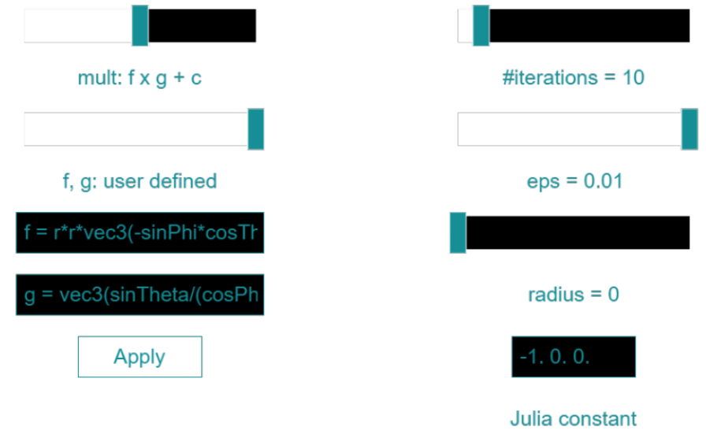

<h2>Description</h2>
This is the repository corresponding to the <a href="http://archive.bridgesmathart.org/2025/bridges2025-373.html">article</a> published at the Bridges conference 2025. A <strong>demo</strong> can be found on the related <a href="http://e-zimmermann.github.io/demos/vractalExplorer.html">project page</a>.

<h2>Installation</h2>
<ol>
  <li>Download or clone repository.</li>
  <li>Use for instance <a href="https://docs.npmjs.com/downloading-and-installing-node-js-and-npm">npm</a> to run local webserver. After installation of Nodejs / npm open folder with downloaded files in terminal and write <code>npm install</code>. </li>
  <li>Afterwards use <code>npm run dev</code> in terminal and access webpage via shown url.</li>
</ol>

<h2>Instructions</h2>
The code runs as web-application with the option to enter the VR mode (described below). After launch the settings can be toggled using <code>y</code> on the keyboard and they look like:

The following list describes the settings and expressions/references used therein refer to the <a href="http://archive.bridgesmathart.org/2025/bridges2025-373.html" target="_blank">article</a>:
<ul>
  <li><code>mult</code> allows to choose among the three implemented iterative schemes: <code>f x g</code>, <code>f x g + c</code>, and <code>f x g + const</code> refer to Equations (3), (4), and (5), respectively.</li>
  <li><code>f, g</code> allows to choose among predefined functions and the option <code>user defined</code>. When the latter is chosen, two input fields appear in which functions can be provided in OpenGL Shading Language (glsl). The following expressions are available:
    <ul>
      <li><code>p</code> which is a vec3 and gets passed as argument to the multiplication with coordinates <code>p.x, p.y, p.z</code>;</li>
      <li><code>r</code> is the Euclidean length of <code>p</code>;</li>
      <li><code>cosPhi, sinPhi, cosTheta1, cosTheta2, cosTheta, sinTheta</code> represent the trigonometric evaluations of the angular arguments obtained from <code>p</code> derived from the reformulation of trigonometric functions.</li>
    </ul>
  </li>
  The functions provided in the input fields are evlatued after clicking <code>Apply</code>.
  <li><code>#iterations</code> determines the number of times the iteration scheme gets evaluated. It ranges between 0 and 100.</li>
  <li><code>eps</code> determines the step size for the constant raymarching. It ranges between 1.e-5 and 1.e-2.</li>
  <li><code>radius</code> determines the radius of the ball at the origin which is only considered for the raymarching. The square of this value is also used to determine the divergence throughout the iterative process, i.e., when a point throughout the iterative process has length larger than the squared radius the originally considered point in space does not belong to the shape. It ranges between 0 to 10.</li>
  <li><code>Julia constant</code> determines the constant used in the iterative scheme from Equation (5). The input field allows to take three float values separated by white space, gets send to the GPU as a vec3, and is evaluated directly.</li>
</ul>
                
Rotation and translation in the scene can be achieved by holding the <code>left mouse</code> or <code>right mouse</code>,
respectively. The <code>mouse wheel</code> allows to zoom in and out.

<strong>VR Mode</strong> 

When the demo-page is accessed on an VR-applicable device like a head mounted display a small icon (see inset) allows to toggle the VR mode.
The following list of controls refer to a Meta Quest 3 headset:
<ul>
  <li>The left controller button <code>y</code> toggles the settings display;</li>
  <li>The left controller thumbstick allows forward and backward movement in gaze direction.</li>
</ul>

